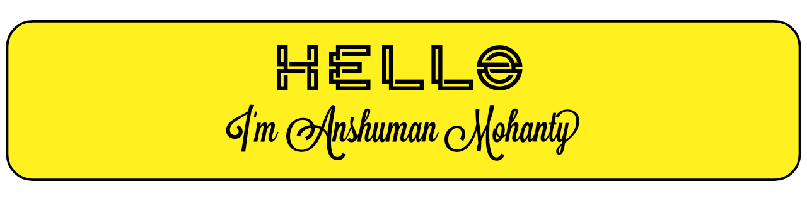

<div align="center">
  
  [](https://github.com/Anshuman2305)
 
  
[](https://github.com/Anshuman2305)
[](https://www.linkedin.com/in/anshuman-mohanty-33463b190/)
[](https://leetcode.com/Anshuman2305/)
[](https://www.instagram.com/i_a__m___/)
[](https://www.facebook.com/anshuman.mohanty.1048/)
[](https://vsco.co/anshuman-mohanty/gallery)
  
  ```
  I enjoy creating things for the internet whether that be a website or an application or anything in 
  between which is not only functional but also beautiful bringing elegant experience.
```
  
[](https://git.io/streak-stats)
  
  
[](https://github.com/anuraghazra/github-readme-stats)


  [](https://github.com/Anshuman2305/Twitter-Clone-NextJs)
  [](https://github.com/Anshuman2305/Mental-Health-CodeUtsava)
   [](https://github.com/Anshuman2305/Blogging-Website-Nextjs)
   [](https://github.com/Anshuman2305/Todo-App)
   [](https://github.com/Anshuman2305/Rock-Identification)
  
  

  
</div>
  


<!--
**Anshuman2305/Anshuman2305** is a ✨ _special_ ✨ repository because its `README.md` (this file) appears on your GitHub profile.

Here are some ideas to get you started:

- 🔭 I’m currently working on ...
- 🌱 I’m currently learning ...
- 👯 I’m looking to collaborate on ...
- 🤔 I’m looking for help with ...
- 💬 Ask me about ...
- 📫 How to reach me: ...
- 😄 Pronouns: ...
- ⚡ Fun fact: ...
-->
